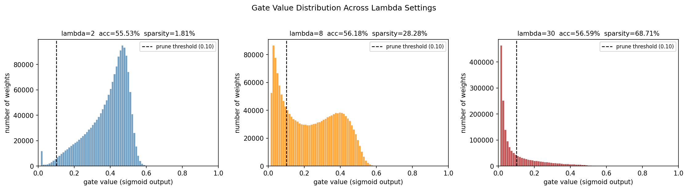

# Self-Pruning Neural Network — CIFAR-10

A neural network that learns to prune itself **during** training using learnable gate parameters — no post-training pruning step needed.

---

## How it works

Each linear layer has a `gate_scores` parameter (same shape as weights). During the forward pass:

```
gates    = sigmoid(gate_scores)   # always in (0, 1)
pruned_w = weight * gates         # element-wise mask
output   = pruned_w @ x + bias
```

Loss = `CrossEntropy + λ × SparsityLoss`, where `SparsityLoss = mean(gates) + mean(gates×(1-gates))`.
The L1 term pulls gates toward zero; the binarization term forces them to commit to 0 or 1.

---

## Results

Trained on CIFAR-10 (3072→512→256→10 MLP) with three λ values. Sparsity = fraction of gates below 0.1 (gates under 0.1 contribute <10% of a weight's value — effectively pruned).

| λ | Test Accuracy | Sparsity |
|---|--------------|----------|
| 2  | 56.70% | 1.81%  |
| 8  | 55.94% | 28.28% |
| 30 | 56.41% | 68.71% |

At λ=30, nearly 70% of weights are pruned with only ~0.3% accuracy drop vs λ=2.

---

## Gate Value Distribution



Clear progression: unimodal bell (λ=2) → bimodal with pruned spike (λ=8) → heavily zero-skewed (λ=30).

---

## Files

| File | Description |
|------|-------------|
| `main.ipynb` | Full implementation — run top to bottom |
| `REPORT.md` | Detailed write-up: mechanism, results, analysis |
| `gate_distribution.png` | Gate histograms from the last training run |
